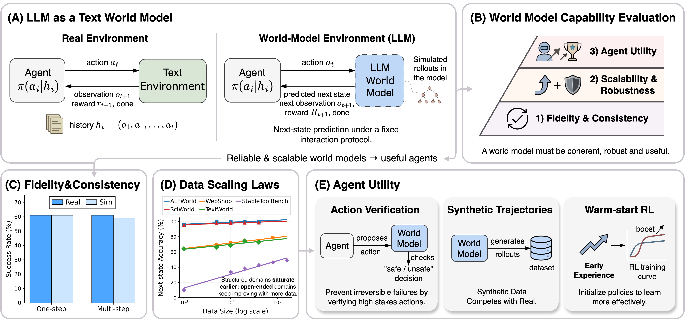

# *From Word to World*: Can Large Language Models be Implicit Text-based World Models?


[](https://arxiv.org/abs/2512.18832)
[](https://macaron.im/mindlab/research/how-world-models-unlock-scalable-agentic-rl)
[](https://huggingface.co/papers/2512.18832)
[](https://huggingface.co/collections/X1AOX1A/llm-as-world-models)
[](https://huggingface.co/datasets/X1AOX1A/LLMasWorldModels)


Code and data for **"*From Word to World*: Can Large Language Models be Implicit Text-based World Models?"**.

## 📰 News

- [2025/12/21] We released the [paper](https://arxiv.org/abs/2512.18832) and [blog post](https://macaron.im/mindlab/research/how-world-models-unlock-scalable-agentic-rl).
- [2025/12/22] We released the [code](https://github.com/X1AOX1A/Word2World), [models](https://huggingface.co/collections/X1AOX1A/llm-as-world-models) and [data](https://huggingface.co/datasets/X1AOX1A/LLMasWorldModels). We verified the evaluation pipeline on **ALFWorld** using **Qwen2.5-7B** (world model) and **gpt-4o** (agent).
- [2025/12/23] Paper is available on [arXiv](https://arxiv.org/abs/2512.18832) and [Hugging Face](https://huggingface.co/papers/2512.18832).

## 🔗 Quick Links

- **Environment setup**: see [Env Setup](#env-setup)
- **Download data**: see [Data Download](#data-download)
- **Evaluate**: see [Evaluation](#evaluation)
- **Train world models**: see [Training World Models](#training-world-models)

## 📑 Table of Contents

- [Overview](#overview)
- [World Model Checkpoints](#list-of-world-model-checkpoints)
- [Usage Examples](#usage-examples)
- [Env Setup](#env-setup)
- [Data Download](#data-download)
- [Evaluation](#evaluation)
  - [Single-step Accuracy](#single-step-accuracy)
  - [Long-horizon Rollouts](#long-horizon-rollouts)
    - [Interaction with Real Environments](#1-interaction-with-real-environments)
    - [Interaction with World Models](#2-interaction-with-world-models)
    - [Map WM Actions to Real Environments](#3-map-wm-actions-to-real-environments)
- [Training World Models](#training-world-models)
- [Contact](#contact)
- [Citation](#citation)

---

## 📌 Overview


<p align="center">
  
</p>

**LLMs as text-based world models for agent learning.**

- **(A) Formulation**: world modeling as next-state prediction under a fixed text interaction protocol.
- **(B) Evaluation axes**: fidelity/consistency, scalability/robustness, and agent utility.
- **(C) Results**: strong fidelity and consistency in both single-step predictions and long-horizon rollouts.
- **(D) Scaling**: predictable improvements with more training data across text environments.
- **(E) Agent gains**: better verification, synthetic data generation, and RL initialization from faithful world models.

## 🧩 List of World Model Checkpoints

| Environment | Qwen2.5-7B | Llama3.1-8B |
|---|---|---|
| ALFWorld | `X1AOX1A/WorldModel-Alfworld-Qwen2.5-7B` | `X1AOX1A/WorldModel-Alfworld-Llama3.1-8B` |
| SciWorld | `X1AOX1A/WorldModel-Sciworld-Qwen2.5-7B` | `X1AOX1A/WorldModel-Sciworld-Llama3.1-8B` |
| TextWorld | `X1AOX1A/WorldModel-Textworld-Qwen2.5-7B` | `X1AOX1A/WorldModel-Textworld-Llama3.1-8B` |
| Webshop | `X1AOX1A/WorldModel-Webshop-Qwen2.5-7B` | `X1AOX1A/WorldModel-Webshop-Llama3.1-8B` |
| StableToolBench | `X1AOX1A/WorldModel-Stabletoolbench-Qwen2.5-7B` | `X1AOX1A/WorldModel-Stabletoolbench-Llama3.1-8B` |


## 🧪 Usage Examples

- For an example interaction between the agent and the world model, see [scripts/interact_with_world_model/run.py](scripts/interact_with_world_model/run.py).


## 🛠️ Env Setup

```bash
# install AgentGym-RL
bash scripts/env_setup/uv_agentgym_rl.sh

# install AgentGym environments
bash scripts/env_setup/uv_alfworld.sh
bash scripts/env_setup/uv_sciworld.sh
bash scripts/env_setup/uv_textworld.sh
bash scripts/env_setup/uv_webshop.sh
```

You can verify each environment by launching its server:

```bash
bash scripts/env_server/start_alfworld.sh
bash scripts/env_server/start_sciworld.sh
bash scripts/env_server/start_textworld.sh
bash scripts/env_server/start_webshop.sh
```

## 📥 Data Download

> Note (ALFWorld): to align with AgentGym, we renamed action `put` → `move` and added a `help` action (see the updated `.twl2` under `scripts/download_data`). Therefore the original `alfworld-download` workflow is **not** compatible. If you downloaded ALFWorld data before, please remove the old data and re-download using the command below; otherwise evaluation may be lower than expected.

```bash
source uv_agentgym_rl/bin/activate
python scripts/download_data/download_data.py
```

## 📊 Evaluation

This repo reports three complementary metrics:

- **Single-step Accuracy**: next-state prediction accuracy under the interaction protocol.
- **WM Task Success Rate**: agent success when interacting with the learned world model.
- **WM2Real Success Rate**: mapping/replay of world-model actions back to the real environment.

### Single Step Accuracy

To compute `Single Step Accuracy`, run:

<details>
<summary>Calculate Single Step Accuracy</summary>

```bash
TASK=alfworld         # alfworld, alfworld_valid_seen, alfworld_valid_unseen, sciworld, textworld, webshop, stabletoolbench
MODEL=X1AOX1A/WorldModel-Alfworld-Qwen2.5-7B                  # world model checkpoint
OUTPUT_ROOT=outputs/single_step_accuracy/${TASK}/${MODEL}     # output root directory
bash scripts/single_step_accuracy/run.sh $TASK $MODEL $OUTPUT_ROOT
```

Example output:

```json
{
    "average_accuracy": 0.9987087517934002
}
```

</details>


### Long Horizon Rollouts


### 1. Interaction with Real Environments

> To collect trajectories on the training set with real environments, set `SPLIT=train`.

To compute `Real Task Success Rate`, run:

<details>
<summary>Run via OpenAI API</summary>

```bash
TASK=alfworld         # alfworld, sciworld, textworld, webshop
RUN=0                 # run id for multiple runs, just for separating output dirs
API_KEY=your_api_key  # your OpenAI API key
API_BASE_URL=your_api_base_url # your OpenAI API base URL
MODEL=gpt-4o          # agent model name
MAX_CONCURRENCY=150   # max concurrency
MAX_ROUND=50          # max round
NUM_EXAMPLES=-1       # num examples
SPLIT=test            # train, test (and valid_seen, valid_unseen for ALFWorld only)
OUTPUT_ROOT=outputs   # output root directory
# this will auto-launch the environment server
bash scripts/interact_with_real_env/run_openai.sh $TASK $RUN $API_KEY $API_BASE_URL $MODEL $MAX_CONCURRENCY $MAX_ROUND $NUM_EXAMPLES $SPLIT $OUTPUT_ROOT
# metrics will be saved to outputs/interaction/real_env/$SPLIT/${TASK}/$MODEL/${TASK}_maxround${MAX_ROUND}_run${RUN}/_metrics.json
```

Example output:

```json
{
    "accuracy": 50.50,  # task success rate
    "success": 101.0,   # total successful interactions
    "api_errors": 0,    # API errors
    "total": 200,       # total interactions
    "time_seconds": 1075.621458530426  # time taken in seconds
}
```

</details>

<details>
<summary>Run via vLLM server</summary>

```bash
TASK=alfworld         # alfworld, sciworld, textworld, webshop
RUN=0                 # run id for multiple runs, just for separating output dirs
MODEL=Qwen/Qwen2.5-7B-Instruct       # agent model name
MAX_CONCURRENCY=150   # max concurrency
MAX_ROUND=20          # max round, reduce to 20 to prevent exceeding the context length
NUM_EXAMPLES=-1       # num examples
SPLIT=test            # train, test (and valid_seen, valid_unseen for ALFWorld only)
OUTPUT_ROOT=outputs   # output root directory
# this will auto-launch the vLLM server and the environment server
bash scripts/interact_with_real_env/run_vllm.sh $TASK $RUN $MODEL $MAX_CONCURRENCY $MAX_ROUND $NUM_EXAMPLES $SPLIT $OUTPUT_ROOT
# metrics will be saved to outputs/interaction/real_env/$SPLIT/vllm/${TASK}/$MODEL/${TASK}_maxround${MAX_ROUND}_run${RUN}/_metrics.json
```

</details>

### 2. Interaction with World Models

To compute `WM Task Success Rate`, run:

<details>
<summary>Run via OpenAI API</summary>

```bash
TASK=alfworld         # alfworld, sciworld, textworld, webshop
MODEL=gpt-4o          # agent model name
API_KEY=your_api_key  # your OpenAI API key
API_BASE_URL=your_api_base_url # your OpenAI API base URL
WORLD_MODEL=X1AOX1A/WorldModel-Alfworld-Qwen2.5-7B # world model checkpoint
MAX_CONCURRENCY=150   # max concurrency
MAX_ROUND=50          # max round
NUM_EXAMPLES=-1       # num examples
SPLIT=test            # train, test (and valid_seen, valid_unseen for ALFWorld only)
OUTPUT_ROOT=outputs   # output root directory
# this will auto-launch the vLLM server for the world model
bash scripts/interact_with_world_model/run.sh $TASK $MODEL $API_KEY $API_BASE_URL $WORLD_MODEL $MAX_CONCURRENCY $MAX_ROUND $NUM_EXAMPLES $SPLIT $OUTPUT_ROOT
# metrics will be saved to outputs/interaction/world_model/$SPLIT/$TASK/$MODEL/$WORLD_MODEL/$MODEL/_metrics.json
```

Example output:

```json
{
    "task": "alfworld",                    # task name
    "agent_model": "gpt-4o",               # agent model name
    "total_items": 200,                    # total items
    "total_success": 109.0,                # total successful interactions
    "processed_items": 200,                # processed items
    "accuracy": 54.50000000000001,         # task success rate
    "api_errors": 0                        # API errors
}
```

</details>

### 3. Map WM Actions to Real Environments

To compute `WM2Real Success Rate`, run:

<details>
<summary>This step will not need API calls</summary>

```bash
TASK=alfworld                 # alfworld, alfworld_valid_seen, alfworld_valid_unseen, sciworld, textworld, webshop
TEST_FILE_ROOT=test_file_root # e.g. outputs/interaction/world_model/${SPLIT}/${TASK}/${MODEL}/${WORLD_MODEL}/${MODEL}
MAX_WORKERS=50                # max workers, set to 1 for textworld
# this will auto-launch the environment server
bash scripts/interact_with_world_model/cal_wm2real.sh $TASK $TEST_FILE_ROOT $MAX_WORKERS
# metrics will be saved to $TEST_FILE_ROOT/valid_on_real_env/_metrics.json
```

Example output:

```json
{
    "total": 200,                # total items
    "processed": 200,            # processed items
    "success": 111,              # total successful interactions
    "errors": 0,                 # API errors
    "accuracy": 0.555            # task success rate
}
```

</details>


## 🏋️ Training World Models

To train the world models, update the dataset field in the LLaMA-Factory config to the corresponding JSON file.

<details>
<summary>Training Data</summary>

| Environment | Dataset JSON | Data Size Used |
|---|---|---|
| ALFWorld | `data/llama_factory/alfworld_train_with_env_54006.json` | 40K |
| SciWorld | `data/llama_factory/sciworld_train_with_env_40630.json` | 40K |
| TextWorld | `data/llama_factory/textworld_train_58805.json` | 40K |
| Webshop | `data/llama_factory/webshop_train_70790.json` | 70K |
| StableToolBench | `data/llama_factory/stabletoolbench_train_175183.json` | 160K |

</details>

<details>
<summary>Example Config for <code>X1AOX1A/WorldModel-Alfworld-Qwen2.5-7B</code> on 4xH100-80G</summary>

```yaml
### model
model_name_or_path: Qwen/Qwen2.5-7B
trust_remote_code: true

### method
stage: sft
do_train: true
finetuning_type: full
deepspeed: src/LLaMA-Factory/examples/deepspeed/ds_z2_config.json  # choices: [ds_z0_config.json, ds_z2_config.json, ds_z3_config.json]

### dataset
dataset_dir: data/llama_factory
dataset: alfworld_train_with_env_54006
template: qwen
cutoff_len: 12288
max_samples: 40000    # 40K for ALFWorld, SciWorld, TextWorld; 70K for Webshop; 160K for StableToolBench
overwrite_cache: true
preprocessing_num_workers: 16
dataloader_num_workers: 4

### output
output_dir: outputs/ckpt/alfworld/qwen2.5_7b/alfworld_train_with_env_40k
logging_steps: 1
save_steps: 160
plot_loss: true
overwrite_output_dir: true
save_only_model: false
report_to: wandb  # choices: [none, wandb, tensorboard, swanlab, mlflow]

### train
per_device_train_batch_size: 2
gradient_accumulation_steps: 16
learning_rate: 1.0e-5
num_train_epochs: 5.0
lr_scheduler_type: constant_with_warmup
warmup_steps: 10
bf16: true
ddp_timeout: 180000000
resume_from_checkpoint: null
max_grad_norm: 100
```

</details>


## 📬 Contact
For any questions, please contact:
- **Yixia Li**: [liyixia@me.com](mailto:liyixia@me.com)

## 📜 Citation

If you use our work in your research, please cite:


```bibtex
@misc{li2025wordworldlargelanguage,
      title={From Word to World: Can Large Language Models be Implicit Text-based World Models?},
      author={Yixia Li and Hongru Wang and Jiahao Qiu and Zhenfei Yin and Dongdong Zhang and Cheng Qian and Zeping Li and Pony Ma and Guanhua Chen and Heng Ji and Mengdi Wang},
      year={2025},
      eprint={2512.18832},
      archivePrefix={arXiv},
      primaryClass={cs.CL},
      url={https://arxiv.org/abs/2512.18832},
}
```